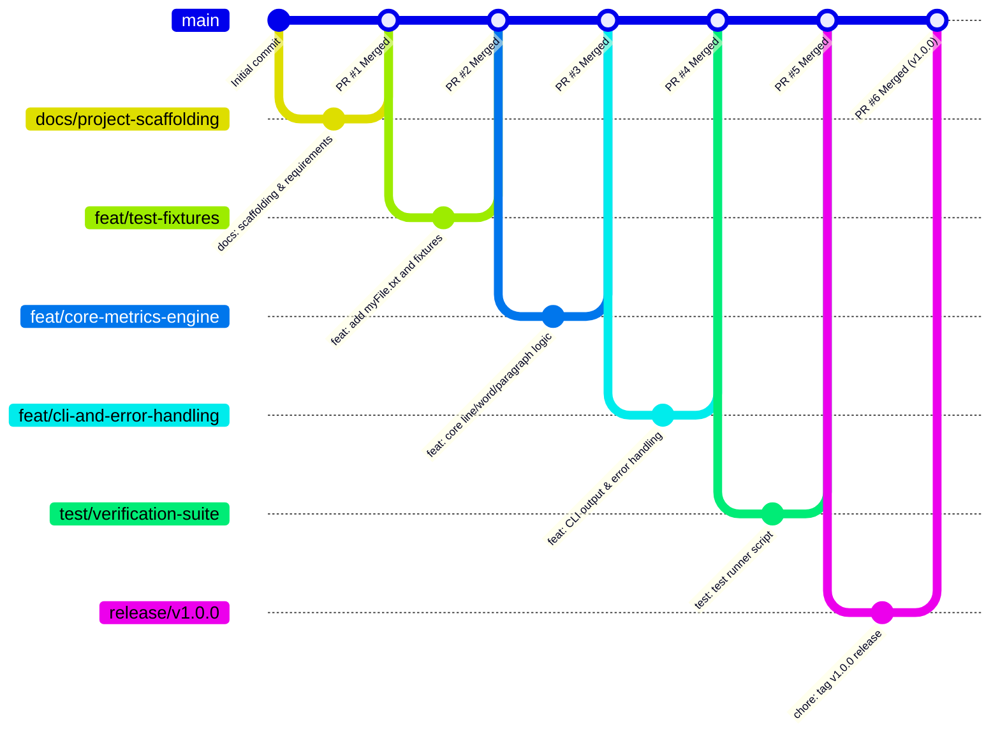

# Delivery Plan: File Metrics Checker (`check.java`)

This delivery plan outlines the phased implementation and delivery of the File Metrics Checker project. **Every feature branch maps directly to a distinct Pull Request (PR)** against the `main` branch, ensuring isolated reviews, modular changes, and verifiable milestones.

---

## 1. Branch & Pull Request Strategy

### 1.1 Pull Request Workflow Principles
1. **One Branch = One Pull Request**: Every phase is developed in an isolated branch and submitted via a dedicated Pull Request.
2. **Linear Baseline**: All PRs target `main`. A PR is only merged once all checks and acceptance criteria for that phase pass.
3. **Traceability**: Each merge retains a distinct merge commit (`git merge --no-ff`) or PR merge commit so branch history is cleanly preserved.
4. **Automated Verification**: Before merging each PR, the code must compile without errors, and edge cases must be validated.

### 1.2 Pull Request Pipeline Overview

| PR # | Source Branch | Target | PR Title | Key Deliverables |
| :--- | :--- | :--- | :--- | :--- |
| **PR #1** | `docs/project-scaffolding` | `main` | `docs: project scaffolding and requirements` | `.gitignore`, `README.md`, `requirements.md` |
| **PR #2** | `feat/test-fixtures` | `main` | `feat: standard myFile.txt and boundary fixtures` | `myFile.txt`, edge-case fixtures |
| **PR #3** | `feat/core-metrics-engine` | `main` | `feat: implement line, word, and paragraph counters` | `check.java` (parsing logic) |
| **PR #4** | `feat/cli-and-error-handling` | `main` | `feat: formatted CLI output and error handling` | `check.java` (CLI UX, file handling) |
| **PR #5** | `test/verification-suite` | `main` | `test: automated test runner and verification suite` | `verify.ps1` automated test runner |
| **PR #6** | `release/v1.0.0` | `main` | `chore: v1.0.0 release preparation` | Final docs, release tag `v1.0.0` |

### 1.3 Git & PR Flow Visual


---

## 2. Pull Request Specifications

---

### PR #1: Project Scaffolding & Requirements
- **Branch:** `docs/project-scaffolding` ➔ `main`
- **PR Title:** `docs: project scaffolding and requirements specification`
- **Objective:** Establish repo cleanliness, Java build hygiene, and define formal project requirements.
- **Deliverables:**
  - `.gitignore`: Ignore Java byte-code (`*.class`), IDE files (`.vscode`, `.idea`), and OS temp files.
  - `README.md`: Overview of the tool, compilation instructions, and branch/PR workflow.
  - `requirements.md`: Detailed functional, technical, and edge-case requirements.
- **PR Description Checklist:**
  - [x] Java `.gitignore` prevents committing compiled artifacts.
  - [x] Complete definitions for line, word, and paragraph metrics.
  - [x] Build and run commands documented.
- **Merge Command:**
  ```powershell
  git checkout main
  git merge --no-ff docs/project-scaffolding -m "Merge PR #1: docs: project scaffolding and requirements specification"
  ```

---

### PR #2: Test Fixtures & Sample Dataset
- **Branch:** `feat/test-fixtures` ➔ `main`
- **PR Title:** `feat: standard myFile.txt and boundary test fixtures`
- **Objective:** Create `myFile.txt` with known benchmark metrics along with edge-case test datasets.
- **Deliverables:**
  - `myFile.txt`: The primary target file containing multiple paragraphs, varied lines, words, and punctuation.
  - `fixtures/empty.txt`: 0-byte file (`0 lines, 0 words, 0 paragraphs`).
  - `fixtures/whitespace_only.txt`: Spaces and tabs (`0 words, 0 paragraphs`).
  - `fixtures/single_line.txt`: Single line without trailing newline (`1 line, N words, 1 paragraph`).
  - `fixtures/consecutive_blank_lines.txt`: Multi-paragraph text separated by multiple consecutive blank lines.
- **PR Description Checklist:**
  - [x] `myFile.txt` created with verified expected counts.
  - [x] Edge-case fixtures created under `fixtures/`.
  - [x] Fixture index with expected counts documented.
- **Merge Command:**
  ```powershell
  git checkout main
  git merge --no-ff feat/test-fixtures -m "Merge PR #2: feat: standard myFile.txt and boundary test fixtures"
  ```

---

### PR #3: Core Metrics Computation Engine
- **Branch:** `feat/core-metrics-engine` ➔ `main`
- **PR Title:** `feat: implement line, word, and paragraph counting logic in check.java`
- **Objective:** Implement the core algorithm that reads a text file and accurately computes the three metrics.
- **Deliverables:**
  - `check.java` core methods:
    - **Line Counting:** Accurate newline iteration using buffered streaming.
    - **Word Counting:** Regex whitespace splitting (`\\s+`) on trimmed non-empty lines.
    - **Paragraph Counting:** State machine tracking `inParagraph` transitions across blank lines.
- **PR Description Checklist:**
  - [x] Code compiles without errors: `javac check.java`.
  - [x] Computes correct line count.
  - [x] Computes correct word count.
  - [x] Computes correct paragraph count.
- **Merge Command:**
  ```powershell
  git checkout main
  git merge --no-ff feat/core-metrics-engine -m "Merge PR #3: feat: implement line, word, and paragraph counting logic in check.java"
  ```

---

### PR #4: User-Facing CLI & Error Handling
- **Branch:** `feat/cli-and-error-handling` ➔ `main`
- **PR Title:** `feat: formatted CLI output and robust error handling`
- **Objective:** Polish the user experience, format terminal output, and handle runtime errors cleanly.
- **Deliverables:**
  - `check.java` enhancements:
    - Formatted summary card on `System.out` displaying file path, lines, words, paragraphs.
    - Input argument support: defaults to `myFile.txt`, or accepts a custom file path via `args[0]`.
    - Graceful error handling: user-friendly message when file is missing or unreadable, avoiding unhandled stack traces.
- **PR Description Checklist:**
  - [x] Running `java check` without arguments processes `myFile.txt`.
  - [x] Running `java check <customFile>` works as expected.
  - [x] Running `java check non_existent.txt` outputs a friendly error and exits with non-zero code.
- **Merge Command:**
  ```powershell
  git checkout main
  git merge --no-ff feat/cli-and-error-handling -m "Merge PR #4: feat: formatted CLI output and robust error handling"
  ```

---

### PR #5: Automated Verification Suite
- **Branch:** `test/verification-suite` ➔ `main`
- **PR Title:** `test: automated test runner and verification suite`
- **Objective:** Add an automated verification script to run regression tests against all fixtures.
- **Deliverables:**
  - `verify.ps1`: Automated PowerShell test runner that:
    - Compiles `check.java`.
    - Executes `check.java` against `myFile.txt` and all fixture files.
    - Asserts that outputs match expected lines, words, and paragraphs.
    - Reports PASS/FAIL with color-coded summary.
- **PR Description Checklist:**
  - [x] Test script runs without requiring manual intervention.
  - [x] All 5 fixtures pass verification with 100% accuracy.
- **Merge Command:**
  ```powershell
  git checkout main
  git merge --no-ff test/verification-suite -m "Merge PR #5: test: automated test runner and verification suite"
  ```

---

### PR #6: Release v1.0.0
- **Branch:** `release/v1.0.0` ➔ `main`
- **PR Title:** `chore: v1.0.0 release finalization and documentation`
- **Objective:** Final end-to-end review, documentation wrap-up, and release tagging.
- **Deliverables:**
  - Finalized `README.md` with complete usage examples.
  - Release tag `v1.0.0`.
- **PR Description Checklist:**
  - [x] Full build and verification pass cleanly.
  - [x] Documentation fully up to date.
  - [x] Release tag ready to apply.
- **Merge Command:**
  ```powershell
  git checkout main
  git merge --no-ff release/v1.0.0 -m "Merge PR #6: chore: v1.0.0 release finalization and documentation"
  git tag -a v1.0.0 -m "Release version 1.0.0: File Metrics Checker"
  ```

---

## 3. Step-by-Step PR Execution Script

To execute this plan locally (or push branches to create remote PRs on GitHub):

```powershell
# Step 0: Initialize Repo
git init
git branch -M main

# --- PR #1 ---
git checkout -b docs/project-scaffolding
# (add .gitignore, README.md, requirements.md)
git add .gitignore README.md requirements.md delivery_plan.md
git commit -m "docs: project scaffolding and requirements specification"
git checkout main
git merge --no-ff docs/project-scaffolding -m "Merge PR #1: docs: project scaffolding and requirements specification"

# --- PR #2 ---
git checkout -b feat/test-fixtures
# (create myFile.txt and fixtures/ files)
git add myFile.txt fixtures/
git commit -m "feat(fixtures): add sample myFile.txt and boundary test fixtures"
git checkout main
git merge --no-ff feat/test-fixtures -m "Merge PR #2: feat: standard myFile.txt and boundary test fixtures"

# --- PR #3 ---
git checkout -b feat/core-metrics-engine
# (implement core check.java)
git add check.java
git commit -m "feat(core): implement line, word, and paragraph counting logic"
git checkout main
git merge --no-ff feat/core-metrics-engine -m "Merge PR #3: feat: implement line, word, and paragraph counting logic in check.java"

# --- PR #4 ---
git checkout -b feat/cli-and-error-handling
# (enhance check.java with CLI formatting and error handling)
git add check.java
git commit -m "feat(cli): formatted CLI output and robust error handling"
git checkout main
git merge --no-ff feat/cli-and-error-handling -m "Merge PR #4: feat: formatted CLI output and robust error handling"

# --- PR #5 ---
git checkout -b test/verification-suite
# (create verify.ps1)
git add verify.ps1
git commit -m "test: automated test runner and verification suite"
git checkout main
git merge --no-ff test/verification-suite -m "Merge PR #5: test: automated test runner and verification suite"

# --- PR #6 ---
git checkout -b release/v1.0.0
# (finalize docs)
git add README.md
git commit -m "chore(release): finalize documentation for v1.0.0"
git checkout main
git merge --no-ff release/v1.0.0 -m "Merge PR #6: chore: v1.0.0 release finalization and documentation"
git tag -a v1.0.0 -m "Release version 1.0.0"
```
